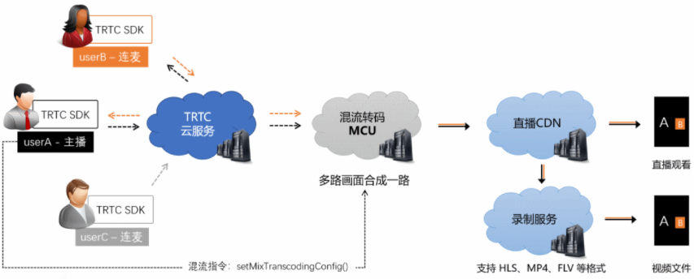

# RTC

**拒绝内卷，创造神话**

1. 目标： 一站式webrtc互动直播解决方案（sfu+mcu），包括娱乐直播和实时互动。
  * 打造出流更快，流畅的直播体验！
  * 做到成本最低，性能优化到极致！
  * 极致的用户体验！ 
  * 0.5~1天搭建一整套webrtc互动直播解决方案。

2. 安全： 代码部署安全、核心功能安全；
   * 后端采用golang/c++开发；防止部署在云服务器上的代码被泄露。
   * 前后端分离，方便维护；

- [音视频直播方案介绍](./音视频直播方案介绍.md)

## rtc技术介绍

- [rtc技术介绍](rtc.md)
- [音视频基础技术](doc/av/README.md)
- [h264_nalu](rtmp/h264_nalu.md)

### webrtc

- [webrtc](./webrtc/README.md)

## ffmpeg

基于ffmepg-sdk开发音视频编码/解码相关后端程序，重点就是要多读ffmpeg源码（前提是C/C++编程基础）。

- [FFmpeg开发入门介绍](https://github.com/cherishman2005/rtc/wiki/FFmpeg%E5%BC%80%E5%8F%91%E5%85%A5%E9%97%A8%E4%BB%8B%E7%BB%8D)
- [ffmpeg部分源码解读](doc/ffmpeg部分源码解读.md)
- [ffmepg抽帧截图](ffmpeg/ffmepg抽帧截图.md)
- [webrtc ffmpeg录制、转码](ffmpeg/ffmpeg_cmd.md)
- [ffmpeg基础操作](./ffmpeg/ffmpeg基础操作.md)
- [AVFrame的释放](./doc/AVFrame的释放.md)

* 音视频混流混画

### I/P/B视频帧

在实时互动直播系统中，很少使用B帧。主要的原因是压缩和解码B帧时，由于要双向参考，所以它需要缓冲更多的数据，且使用的CPU也会更高。由于实时性的要求，所以一般不使用它。不过对于播放器来说，遇到带有B帧的H264数据是常有的事儿。在没有B帧的情况下，存放帧的顺序和显示帧的顺序就是一样的，PTS和DTS的值也是一样的。

### gpu硬件解码

显卡解码

对于解码来讲相对简单一些，解码性能最主要看两个指标就可以了，一个是单解码器解码的帧数，一个是解码芯片数。

## YUV

- [YUV与RGB转换](https://github.com/cherishman2005/rtc/wiki/YUV%E4%B8%8ERGB%E8%BD%AC%E6%8D%A2)

### YUV各种格式转换

* yuv420sp（I420）

* yuv420p

* NV12

* NV21

## RTMP

- [RTMP](doc/av/RTMP.md)
- [rtmp开发](rtmp.md)

## webrtc

- [sdp](/ffmpeg/sdp.md)

## opencv

* 直播增加特效（戴帽子）

## obs推流

- [obs推流](https://github.com/cherishman2005/rtc/wiki/obs%E6%8E%A8%E6%B5%81)

# 小结

* 计算机视觉就是人工智能的眼睛。

对于中小型公司，做音视频直播，视频会议相关的产品，自研 UDP，P2P 是不太可能的，运营这样一个研发团队，一年的开销是千万级别的投入。所以 webrtc，甚至第三方基于 webrtc开发的sdk，成了中小公司进入音视频领域的最快做产品的方案。未来 WebRTC 在国内的应用，也会越来越流行，需要大量的开发者。

* 做音视频技术，可以深而不广，也可以广而不深。
  * 深而不广：专业选手；
  * 广而不深，略懂一些，如果有音视频需求，直接接第三方音视频服务。

* 做AI相关技术

  切记： 不要小打小闹，只懂皮毛；要在一个领域深耕，精雕细琢 才能做出精品。-- 小打小闹做出来的东西没有竞争力。

* 积极拥抱开源

* 不弄虚作假

* 解决问题的能力
* 深度 -》广度
* 关注前沿技术的发展
* 突破舒适区

## 音视频技术指标

作为音视频技术公司，很多基础指标必须重点研究：（包括开发、测试等环节；测试环境和正式环境）

* 低时延： 端到端的时延有没有认真测试过？指标是否达到要求？
* 低码率
* 首屏秒卡： 启动时延

要尝试各种手段测试，开发各种测试工具。

## 技术要落地

* 技术是要落地的，企业是要生存的，需要产生价值。

### 技术挖掘

* 智能抠图
  * 绿幕抠图 比别人的更好 -- 直播，电商，购物
  * 没有颜色溢出，没有毛边，锯齿。

* 插帧 
  * 消费侧插帧

# FAQ

* webrtc录制的视频 出现先模糊，后清晰的过程。有没有什么优化方法，让webrtc接入 一开始就是清晰视频。

* 优先级高的问题：播放失败率太高；

* 为什么大家偏向 srs-librtmp去推rtmp流  ，而不用ffmpeg librtmp去推流？

* 抽帧截图： 无损压缩，有损压缩。 
  
  根据场景选择无损还是有损压缩。 一般的直播场景多考虑采用有损压缩：节约存储和带宽。

## 直播出现花屏，蓝屏的问题处理

（1）在音视频后端处理（混画、转码）时，对一个GOP有丢帧的后，就丢掉剩余的帧；从下一个GOP开始做解码、编码操作； -- 解决方案

（2）直播录制的视频花屏/绿屏，使用ffmpeg转码。ffmpeg解码、编码会丢掉一个GOP内剩余的异常帧。

## video player跨平台播放器

https://jishuin.proginn.com/p/763bfbd75e45

ffplay 是 ffmpeg 自带的跨平台播放器，使用 C 语言编写。当你在编译 ffmpeg 添加如下参数 「--enable-ffplay」 的时候 ，编译完成会在 「output/bin/」  下产生一个 ffplay  可执行文件，使用 「ffplay xxx.mp4」 就可以播放一个媒体文件，它主要是以 ffmpeg + sdl 实现的一个播放器。其实大名鼎鼎的 ijkplayer 就是基于 ffplay.c 进行的二次开发，所以掌握 ffplay 原理对我们开发播放器有非常大的帮助。

# 个人感悟

* 做一个非常有信念感的人，必须把一件事情做好，并做到极致。
* 不要内卷，必须提升自己的能力。

* windows webrtc编译花了很久时间，陷入了泥潭。-- 所以一定要做擅长的领域，暂时避开不擅长的技术。
  * 不擅长pc前端开发，就先避开。重点做后端。

## 必须要有信念感

* 有信念、有决心 把一件事情做好：我花了3个周末把 2路混画c++程序 调试出来。-- 任何困难都阻止不了我前进的步伐。

# 参考链接

- [FFmpeg 音视频开发 20 年](https://jishuin.proginn.com/p/763bfbd5802d)
- [I帧、P帧、B帧、GOP、IDR 和PTS, DTS之间的关系](https://www.cnblogs.com/yongdaimi/p/10676309.html)
- [https://jishuin.proginn.com/p/763bfbd75e45](https://jishuin.proginn.com/p/763bfbd75e45)
- [webrtc编译](https://www.cnblogs.com/xl2432/p/13137531.html)
- [webrtc编译](https://cloud.tencent.com/developer/article/2021897)
