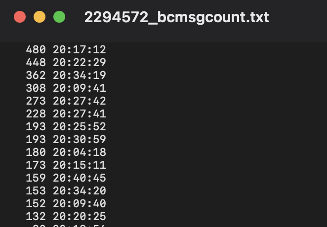

# RTM electron卡顿问题定位

## 问题

日期：2020-11-26 

频道二：
老师id:2294572
频道id：p2294572
时间点一：20:09:40
时间点二：20:17:00
时间点三：20:22:40
时间点四：20:27:40
时间点五：20:34:20

## RTM js-sdk

1. channel只是做了优化，缓解了卡顿问题。真正造成卡顿的原因是如setAttribute设置学生 属性发了无用广播。

### hummer-channel js-sdk优化

hummer-channel js-sdk 根据项目要求 已经1年不再更新维护；

排查卡顿问题，把hummer-rts js-sdk的迭代优化的更新  合入到hummer-channel。 —— 仅此而已。

RTS是经过比较严格的测试，也在 中信银行等toB客户商用。

### 深层次分析

* 真正造成卡顿的原因是如setAttribute设置学生 属性发了无用广播。

老师端每秒要接收400多条广播推送消息，js端扛不住，估计native也撑不住。

# 小结

* 设计： 怎么做到高并发？

  如果大量用户去设置用户属性，要根据需要

  只有设置 teacher属性（重要属性） 才广播。如果几百或者几千个学生都设置属性，广播出去， js-sdk扛不住。

  所以根据需要重要性，来设置是否触发广播。

* 版本要迭代更新
