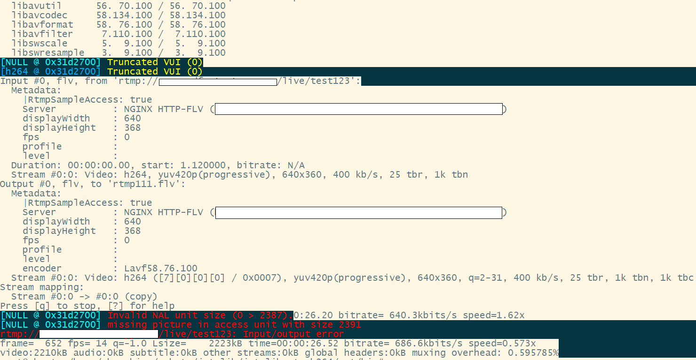

# ffmpeg-c++开发调试技巧

推流端（rtp） -> rtp转推到rtmp（自研ffmpeg C++程序） -> nginx-rtmp收流 -> vlcplayer播放（或ffmpeg收流保存）

## 调试技巧

* 多采用ffmpeg收流，可以发现直播流在 h264 nalu单元 avpacket/avframe中的成员赋值是否正确，或者异常处理是否完善。

如 ffmpeg收流 报warning，最后还报错； 但是vlcplayer播放正常，发现不了错误。

