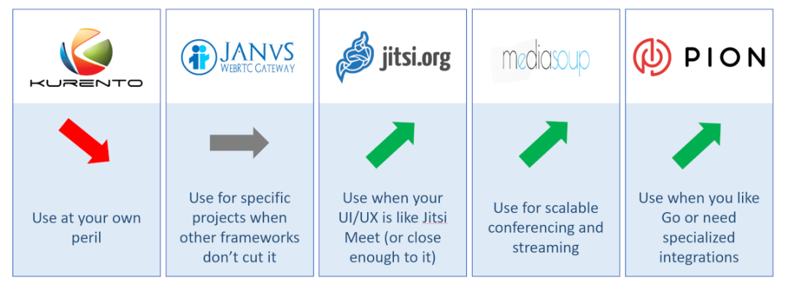

# webrtc

- [rtp-h264](/webrtc/rtp-h264.md)

## webrtc P2P视频通话

## 基于ffmpeg c++ 后端 音视频处理工具

# FAQ

* 卡顿
* 花屏

## RTP SDP（Session Describe Protocol），会话描述协议 能否携带token鉴权信息？

* 可以自定义字段，携带token信息

## webrtc 2路流混流，有时会非常模糊，有什么好的解决方法？

* 如果是同步虚拟摄像头播放的，可能片源就是低画质的；然后在画面放大的情况下播放。

## webrtc推流时怎样设置固定宽高？

* webrtc推流过程中，宽高 会发生变化。webrtc推流时怎样设置固定宽高？
* 视频编码时 分辨率发生变化 怎么办？

### webrtc分辨率分析

chrome://webrtc-internals/

## webrtc 点对点视频如何固定码率传输 达到视频播放分辨率不变的效果？

设置了720p 1080p 分辨率 在网络抖动的情况下 分辨率发生了变话 如何让分辨率不变呢？

* 方法1：RTCConfiguration enableCpuOveruseDetection=false 关闭分辨率变换；
* 方法2：修改源码，调整固定帧率、定分辨率、自适应调整策略；

# 参考链接

- [https://web.dev/articles/webrtc-basics?hl=zh-cn](https://web.dev/articles/webrtc-basics?hl=zh-cn)

- [解决ffmpeg拉流转发频繁丢包问题max delay reached. need to consume packet](https://www.cnblogs.com/tc310/p/11218236.html)

- [https://www.nxrte.com/jishu/webrtc/11920.html](https://www.nxrte.com/jishu/webrtc/11920.html)
